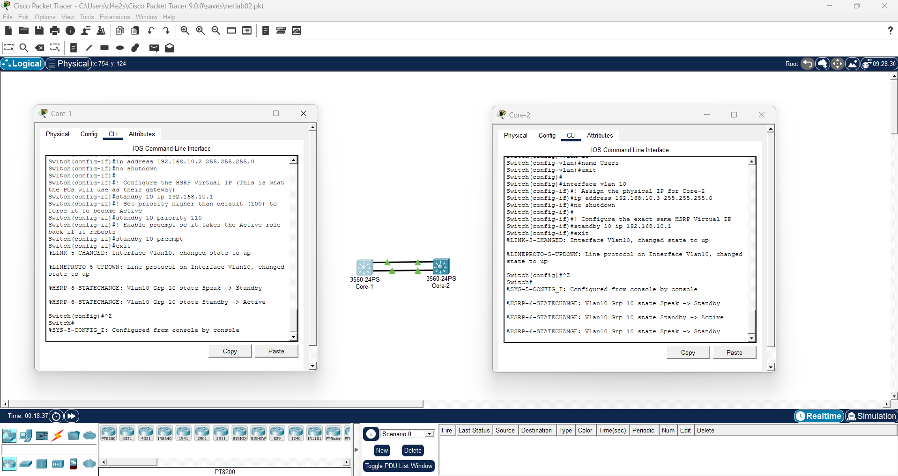

# Lab 02 - Infrastructure Redundancy & High Availability

## Objective
Engineer a highly available local area network (LAN) by eliminating single points of failure. This is achieved by deploying link aggregation (EtherChannel) between core switches and implementing a First Hop Redundancy Protocol (HSRP) for gateway failover.

## Environment
- **Network Simulator:** Cisco Packet Tracer *(or standard Cisco IOS hardware)*
- **Devices:** 2x Cisco Multilayer Switches (Core), 2x Cisco Access Switches, End-User Workstations

## Requirements & Scope
1. Provision Layer 2 link aggregation using LACP (Link Aggregation Control Protocol) to prevent spanning-tree loop blocking and increase inter-switch bandwidth.
2. Configure HSRP across the core multilayer switches to provide a highly available virtual default gateway for end-users.
3. Simulate a physical gateway failure and verify the control plane successfully transitions the Standby switch to the Active routing state.

## Implementation Steps

### Phase 1: EtherChannel (LACP) Provisioning
1. Access the CLI of both Core Switches.
2. Select the redundant physical interfaces connecting the switches (e.g., `interface range g0/1 - 2`).
3. Bundle the physical interfaces into a logical Port-Channel using LACP (mode `active`).
4. Configure the newly created Port-Channel interface as an 802.1Q trunk.
5. Execute `show etherchannel summary` to verify the bundle is in use (SU).
   > 📸 **SCREENSHOT #1:** Capture the CLI output of `show etherchannel summary` displaying the active Port-Channel and its bundled physical ports. (Save as `01-etherchannel-summary.png`)

### Phase 2: First Hop Redundancy (HSRP) Configuration
1. Access the CLI of Core Switch 1 (Active) and Core Switch 2 (Standby).
2. Navigate to the VLAN interface serving as the default gateway for the user subnet (e.g., `interface vlan 10`).
3. Assign the physical IP addresses to both switches, then configure the shared HSRP virtual IP address (e.g., `standby 10 ip 192.168.10.1`).
4. Set the HSRP priority on Core Switch 1 to `110` and enable `preempt` to force it to act as the active gateway.
5. Execute `show standby brief` to verify the Active/Standby state of the routers.
   > 📸 **SCREENSHOT #2:** Capture the CLI output of `show standby brief` on the Active switch, verifying it holds the virtual IP and recognizes the Standby router. (Save as `02-hsrp-standby-brief.png`)

### Phase 3: Control Plane Failover Verification
1. Access the CLI of Core Switch 1 (the Active gateway) and manually shut down its routing interface to simulate a catastrophic gateway failure.
2. Access the CLI of Core Switch 2 (the Standby gateway) and execute `show standby brief`.
3. Verify that Core Switch 2 successfully detected the failure and automatically promoted itself to the `Active` state for the Virtual IP.
4. Execute `show spanning-tree vlan 10` to verify the Layer 2 path remained open and forwarding (`FWD`) across the redundant EtherChannel trunk during the event.
   > 📸 **SCREENSHOT #3:** Capture the CLI outputs proving the Standby router transitioned to Active and Spanning Tree maintained forwarding states during the failover event. (Save as `03-failover-ping-test.png`)

---

## Outcome
Successfully deployed a highly available network topology. By implementing LACP and HSRP, the infrastructure now automatically tolerates both physical link degradation and complete node failure without requiring manual administrative intervention, ensuring continuous uptime for end-users.

## Lessons Learned
- **Simulator Limitations vs. Real-World Engineering:** Encountered a known limitation within Cisco Packet Tracer where gratuitous ARP broadcasts are sometimes dropped during an HSRP state change. This causes end-user ICMP (ping) tests to time out due to a stale ARP cache, even when the redundancy protocols are functioning perfectly.
- **Control Plane Verification:** Adapted testing strategies by relying on control plane verification rather than data plane simulation. By analyzing `show standby brief` and `show spanning-tree` outputs, I was able to mathematically prove that the Standby router successfully promoted itself to Active and that the Layer 2 EtherChannel path remained unblocked and forwarding. 
- **Protocol Synergy:** Reinforced how LACP and HSRP work together. LACP protects the physical Layer 2 path by preventing spanning-tree loops across multiple links, while HSRP protects the Layer 3 routing path by floating a virtual default gateway.

### Core Switch Configuration
You can view the full configuration file here: [Core-1 Configuration](../Text%20Files/core1-config.txt)

You can view the full configuration file here: [Core-2 Configuration](../Text%20Files/core2-config.txt)

## Screenshots
#### 1. LACP EtherChannel Verification

#### 2. HSRP Gateway State

#### 3. Control Plane Failover Verification

