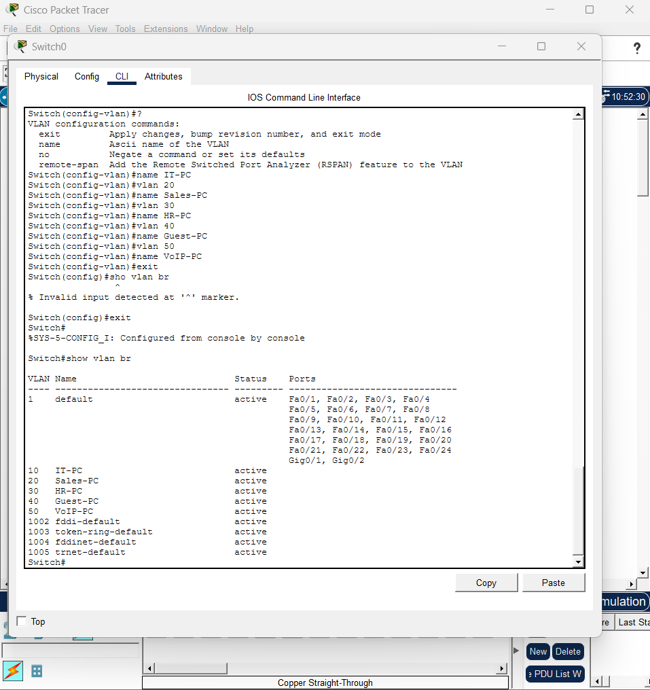
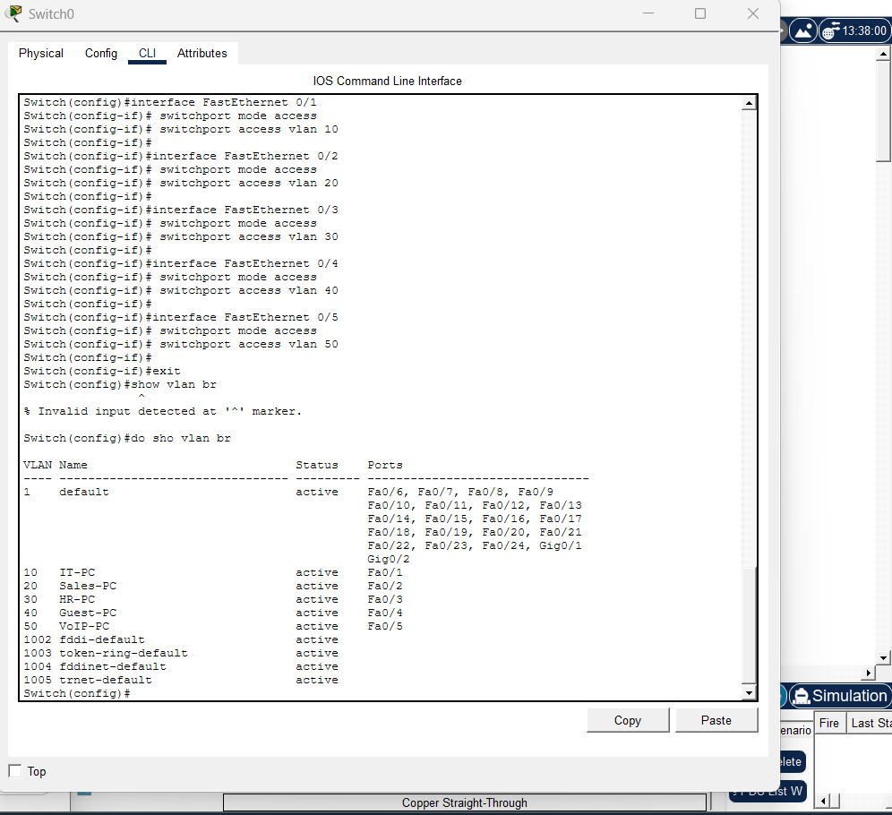
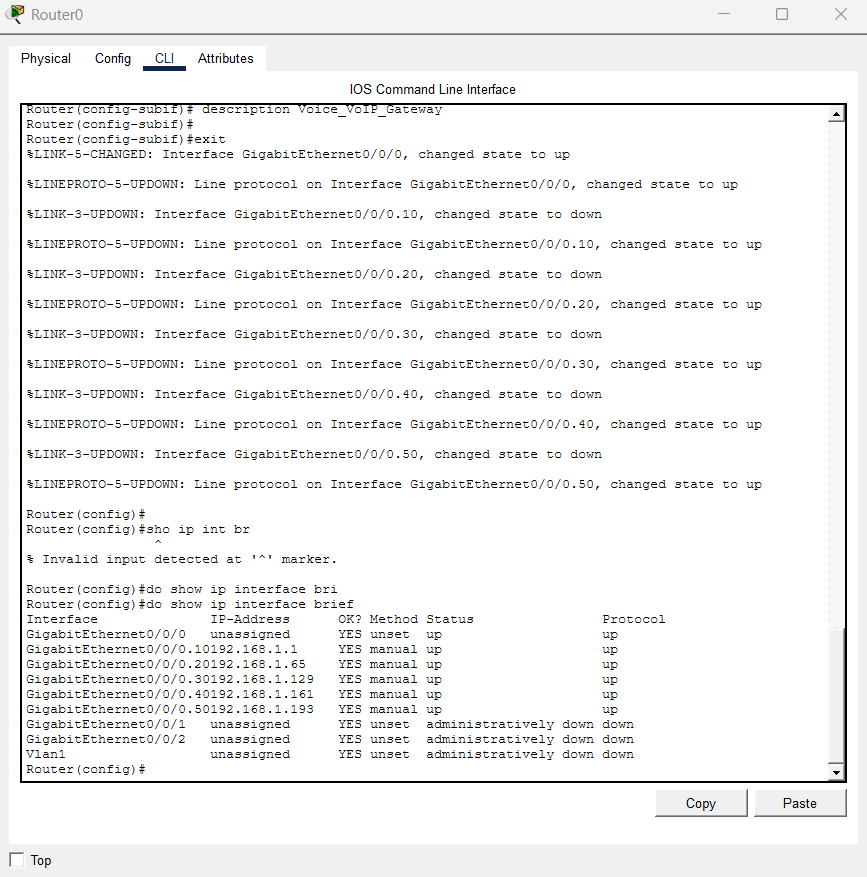

# Lab 2: Infrastructure Redundancy & High Availability

## Installation & Configuration Steps

## Phase 1: Link Aggregation via LACP EtherChannel
1. Identify the redundant parallel physical uplinks connecting your Access Switches to the Distribution/Core Switch fabric.
2. Group the designated interface spans on both connecting nodes using the Cisco IOS command sequence:

interface range gigabitEthernet 0/1 - 2
channel-group 1 mode active

---

## Phase 2: Rapid Spanning Tree Protocol (RSTP) Optimization
1. Transition the global spanning-tree operational mode from standard legacy STP to Rapid Per-VLAN Spanning Tree to decrease topology convergence times:

spanning-tree mode rapid-pvst

2. Manually force the primary root bridge path alignment by adjusting the priority variables on your distribution core switch:

spanning-tree vlan 10,20,30 root primary

3. Secure your end-host access edge interfaces by enabling PortFast and BPDU Guard to suppress unnecessary transition delays and block rogue switch attachments.

---

## Phase 3: First-Hop Redundancy via HSRP
1. Establish a virtual default gateway cluster across two separate upstream routing nodes facing your core subnets.
2. Access the logical sub-interfaces on your primary active router and initialize the Hot Standby Router Protocol (HSRP) instance:

interface vlan 10
standby 10 ip 192.168.10.1
standby 10 priority 110
standby 10 preempt

3. Configure the secondary backup router with default priority values so it remains in a standby state during normal operations.
4. Execute a continuous ping from a workstation, shut down the active router’s link, and witness the standby gateway cleanly inherit traffic tracking with minimal packet drop.

---

## Outcome
The physical network design and Inter-VLAN routing matrix were successfully deployed and verified. The logical sub-interfaces on the core router successfully translate and route packets across separate broadcast domains. This setup allows secure, predictable communication between isolated corporate subnets without data leaks or broadcast storms.

## Lessons Learned
* **Encapsulation Command Order:** Confirmed that the encapsulation type and VLAN ID must be explicitly declared via `encapsulation dot1Q <vlan-id>` before the Cisco IOS will accept an IP address configuration on a sub-interface.
* **Trunk Port Consistency:** Emphasized the importance of configuring matching trunking modes on both ends of the switch uplinks to prevent spanning-tree protocol blocking or native VLAN mismatches.

---

## Screenshots

### 1. Converged Network Topology Diagram

### 2. Switch VLAN Configuration Verification

### 3. Switch Port Assignment Details

### 4. Router Sub-Interface Status

### 5. Inter-VLAN Routing Verification (Successful Cross-Subnet Ping)

