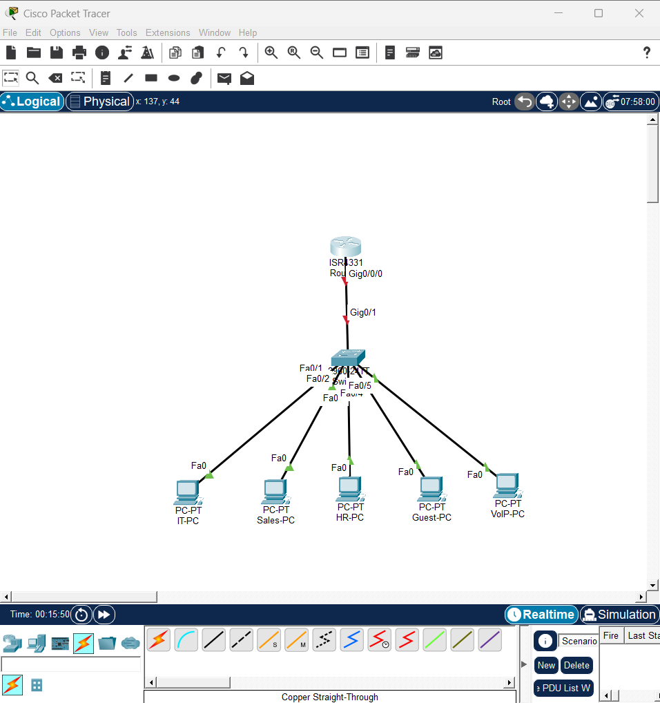
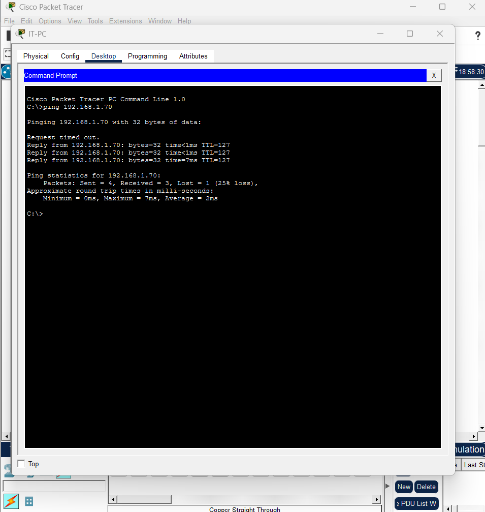
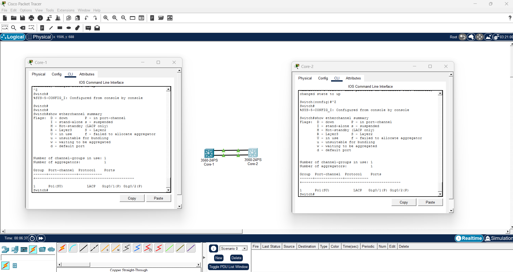
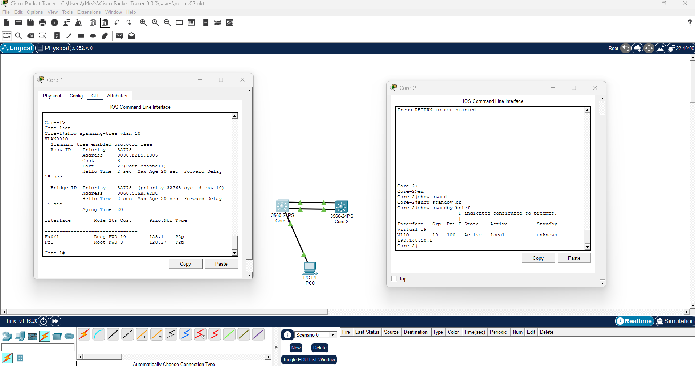
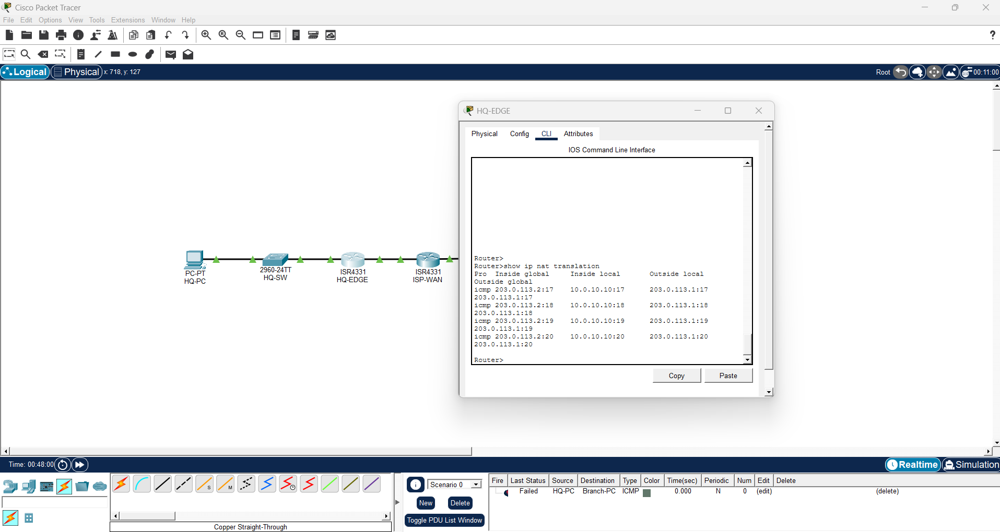
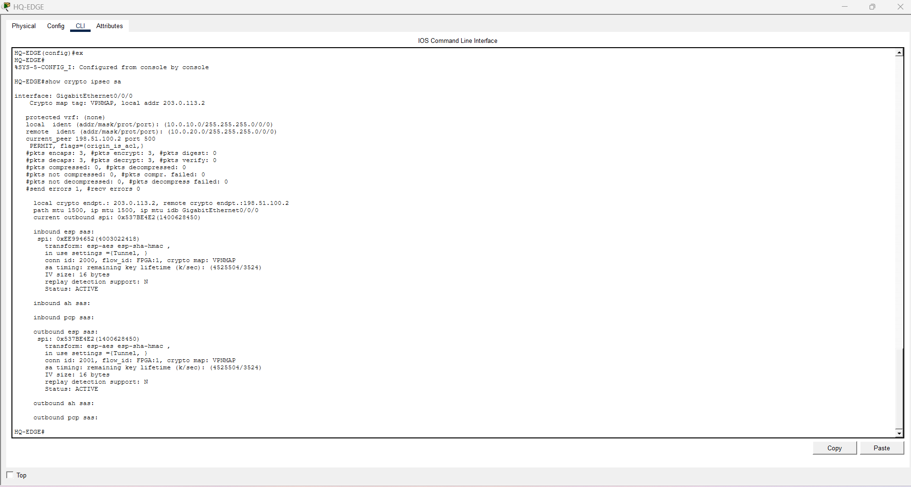

# Network-Routing-Switching
Enterprise networking portfolio featuring Cisco routing and switching labs, multi-department VLAN architectures, infrastructure redundancy (STP/HSRP), and secure edge VPN configurations.

## 🛠️ Network Lab Topology & Roadmap

### ✅ Lab 1: Corporate Core Architecture (Routing & Switching)# Network-Routing-Switching

Deployment documentation and standard operating procedures (SOPs) for the enterprise network architecture, including high availability (STP/HSRP) and secure edge VPN configurations.

## 🛠️ Network Topology & Deployment Roadmap

## ✅ Phase 1: Corporate Core Architecture Provisioning
- **Status:** ✅ Completed
- **Documentation:** View Phase 1 SOP
- **Description:** Multi-department enterprise network deployment implementing VLSM, subinterfaces, Inter-VLAN routing (Router-on-a-Stick), and DHCP relay configurations using 802.1Q Trunking and Access Control Lists (ACLs).

### 📸 Phase 1 Quality Assurance (QA) Validation

*1. Network Topology Design*

*2. Inter-VLAN Routing Validation*

## ✅ Phase 2: High Availability & Redundancy Implementation
- **Status:** ✅ Completed
- **Documentation:** View Phase 2 SOP
- **Description:** Eliminating single points of failure by engineering backup paths and optimizing layer 2 loop prevention using EtherChannel (LACP), Rapid Spanning Tree Protocol (RSTP), and Hot Standby Router Protocol (HSRP).

### 📸 Phase 2 Quality Assurance (QA) Validation

*1. LACP EtherChannel Validation*

*2. Control Plane Failover Validation*

## ✅ Phase 3: Secure Edge & Remote Access Provisioning
- **Status:** ✅ Completed
- **Documentation:** View Phase 3 SOP
- **Description:** Securing the network perimeter and establishing encrypted communication channels for remote sites utilizing Static/Dynamic NAT, Port Address Translation (PAT), and IPsec Site-to-Site VPNs.

### 📸 Phase 3 Quality Assurance (QA) Validation

*1. NAT/PAT Translation Table*

*2. IPsec VPN Tunnel Status*

## 📁 Repository Directory Structure
- **/SOPs** — Step-by-step deployment documentation, configuration guides, and validation walkthroughs.
- **/Topologies** — Architecture design files and network maps.
- **/Configurations** — Device running-configurations (Cisco IOS) mapped to each deployment phase.
- **/Validation-Evidence** — Visual proof of successful command outputs and topology integrations.
- **Status:** ✅ Completed
- **Documentation:** [View Lab Documentation](./Labs/Lab-01-Physical-Topology-Routing.md)
- **Description:** Designing a multi-department enterprise network implementing VLSM, subinterfaces, Inter-VLAN routing (Router-on-a-Stick), and DHCP relay configurations using 802.1Q Trunking and Access Control Lists (ACLs).

#### 📸 Lab 1 Verification
**1. Network Topology Design**

**2. Inter-VLAN Routing Verification**

---

### ✅ Lab 2: Infrastructure Redundancy & High Availability
- **Status:** ✅ Completed
- **Documentation:** [View Lab Documentation](./Labs/Lab-02-Infrastructure-Redundancy-&-High-Availability.md)
- **Description:** Eliminating single points of failure by engineering backup paths and optimizing layer 2 loop prevention using EtherChannel (LACP), Rapid Spanning Tree Protocol (RSTP), and Hot Standby Router Protocol (HSRP).

#### 📸 Lab 2 Verification
**1. LACP EtherChannel Verification**

**2. Control Plane Failover Verification**

---

### ✅ Lab 3: Secure Enterprise Edge & Remote Access
- **Status:** ✅ Completed
- **Documentation:** [View Lab Documentation](./Labs/Lab-03-Secure-Enterprise-Edge.md)
- **Description:** Securing the network perimeter and establishing encrypted communication channels for remote sites utilizing Static/Dynamic NAT, Port Address Translation (PAT), and IPsec Site-to-Site VPNs.

#### 📸 Lab 3 Verification
**1. NAT/PAT Translation Table**

**2. IPsec VPN Tunnel Status**

---

## 📁 Repository Directory Structure
- **/Labs** — Step-by-step markdown documentation, lessons learned, and verification walkthroughs.
- **/Topologies** — Cisco Packet Tracer (`.pkt`) and architecture design files.
- **/Text Files** — Device running-configurations (Cisco IOS) mapped to each lab.
- **/Screenshots** — Visual proof of successful command outputs and topology designs.
